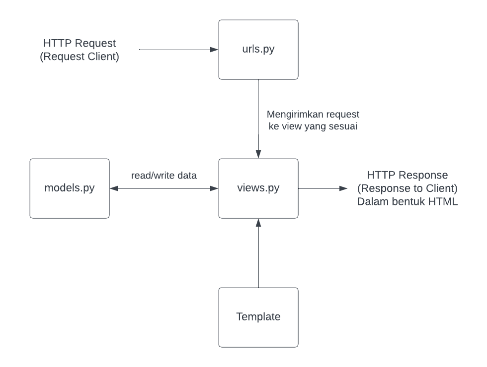
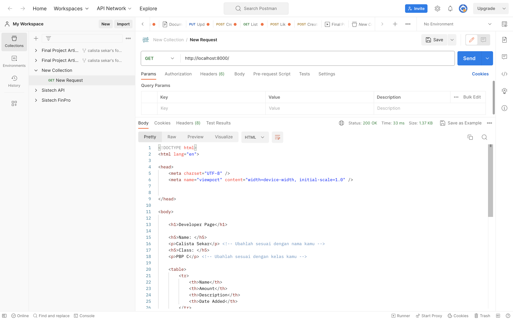
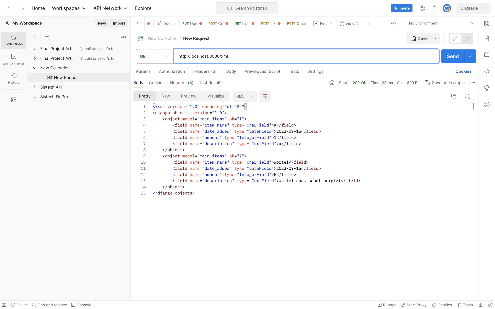
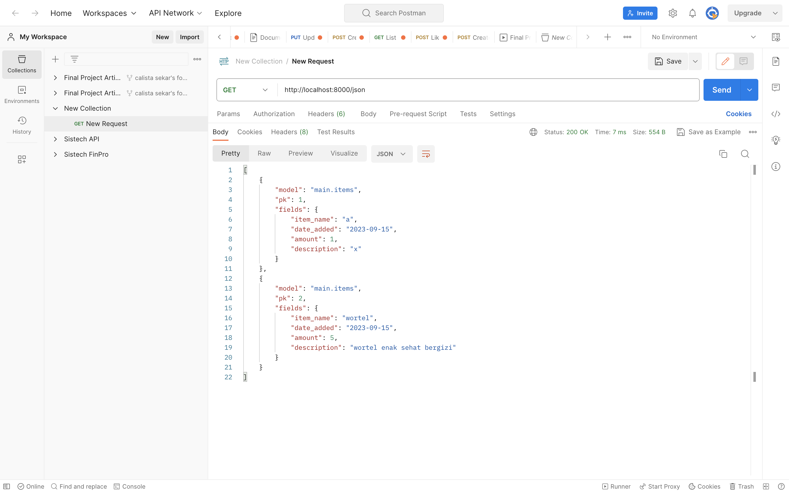
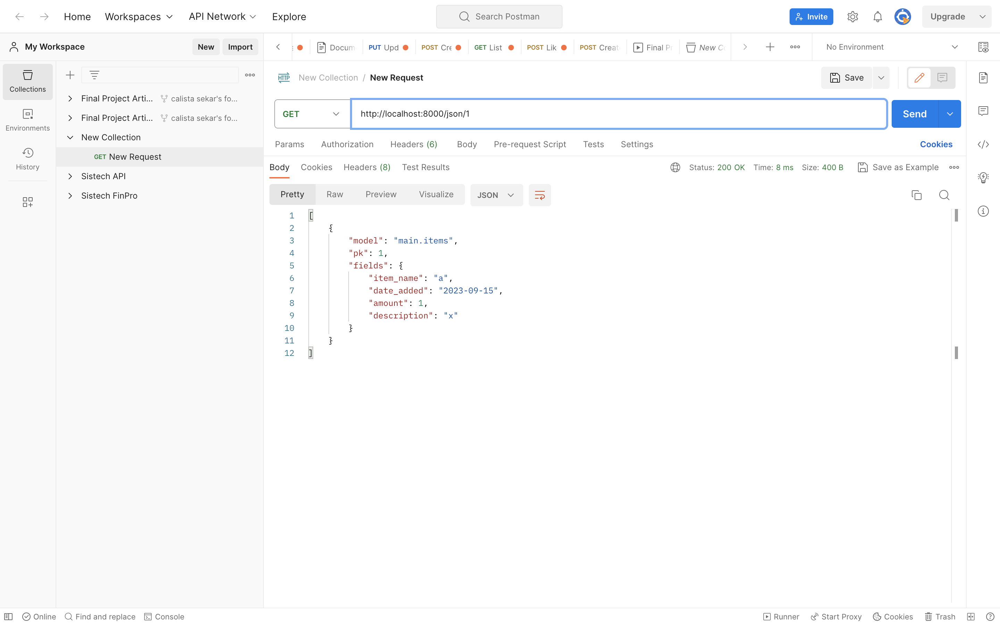
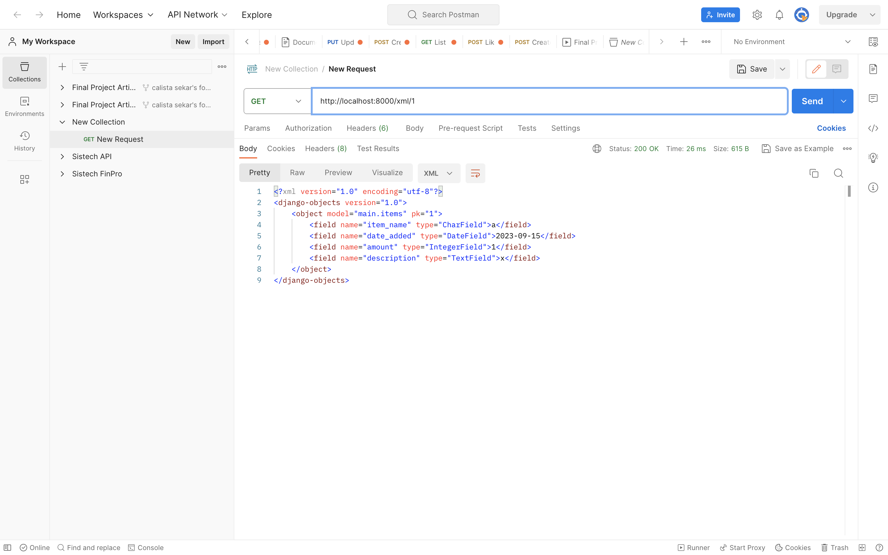

# FoodStock
FoodStock merupakan suatu aplikasi berbasis _website_ yang berfungsi sebagai platform untuk membantu pengelolaan inventori stok bahan makanan suatu bisnis FnB. Melalui aplikasi ini, pengguna dapat mengetahui stok bahan makanan dasar terkini, bahan makanan yang sudah perlu untuk dilakukan _restock_, hingga melakukan pendataan harga bahan makanan tersebut.

### Penyusun Proyek
Nama : Calista Sekar    
NPM : 2206082064    
Kelas : C   

## Langkah-Langkah Development FoodStock
### Membuat sebuah proyek Django baru.
1.  Saya membuat direktori terlebih dahulu dengan nama `foodstock` kemudian membuka terminal shell dari direktori tersebut. 
2. Saya membuat virtual environment dengan perintah `python -m venv env` 
3. Virtual environment diaktifkan dengan perintah `source env/bin/activate` sehingga terdapat tanda (env) pada terminal.
4. Saya membuat berkas requirements.txt dan menambahkan beberapa depedencies di bawah ini :
```
    django
    gunicorn
    whitenoise
    psycopg2-binary
    requests
    urllib3
```
5. Saya memasang dependencies dengan perintah `pip install -r requirements.txt`
6. Setelah semua persiapan selesai, saya membuat proyek Django baru bernama `foodstock` dengan perintah `django-admin startproject foodstock .` Setelah perintah ini dijalankan, Django otomatis menginisiasi proyeknya di direktori yang sama.
7. Setelah proyek dibuat, saya menambahkan `*` pada `ALLOWED_HOST` di file `setting.py` untuk mengizinkan semua host untuk mengakses aplikasi web.

### Membuat aplikasi dengan nama main pada proyek tersebut.
1. Pada terminal direktori utama `foodstock`, saya mengaktifkan _virtual environment_ untuk mengisolasi _package_ dan _dependencies_ sehingga tidak bertabrakan dengan versi lainnya pada laptop saya.
2. Untuk membuat aplikasi baru dengan nama `main`, saya menjalankan perintah `python manage.py startapp main`. Aplikasi baru ini
berisi struktur awal yang akan menjadi pondasi aplikasi foodstock kedepannya.
3. Sebelum mengimplementasikan _template_, saya mendaftarkan terlebih dahulu aplikasi main ke dalam proyek dengan menambahkan `main` pada `INSTALLED_APPS` di dalam berkas `setting.py`
4. Selanjutnya, saya membuat direktori baru `templates` di dalam direktori aplikasi main serta membuat berkas baru bernama `main.html` yang akan berisikan _landing page_ aplikasi FoodStock.

### Melakukan routing pada proyek agar dapat menjalankan aplikasi main.

### Membuat model pada aplikasi main dengan nama Item dan memiliki atribut wajib sebagai berikut.
* `name` sebagai nama item dengan tipe CharField.
* `amount` sebagai jumlah item dengan tipe IntegerField.
* `description` sebagai deskripsi item dengan tipe TextField.

Setelah memeriksa bahwa tampilan HTML aplikasi telah sesuai, saya membuat berkas baru `models.py` pada direktori aplikasi main. Berkas tersebut akan berisikan model yang akan digunakan pada aplikasi ini.
```
    from django.db import models

    class Items(models.Model):
        item_name = models.CharField(max_length=255)
        amount = models.IntegerField()
        description = models.TextField()
```

**Penjelasan kode**
- `Item` : nama model yang akan digunakan
- `nama` : nama item stok makanan
- `amount` : jumlah stok makanan tersebut saat ini
- `description` : deskripsi singkat mengenai item stok makanan

Model yang telah dibuat tersebut perlu untuk dimigrasikan  ke basis data lokal. Pada direktori yang sama, saya menjalankan perintah `python manage.py makemigrations` untuk membuat berkas migrasi yang berisi perubahan yang telah dilakukan pada model. Namun, pada makemigrations, perubahan belum diaplikasikan pada basis data.
Untuk menerapkan migrasi ke basis data lokal, saya menjalankan perintah `python manage.py migrate`. Dengan demikian, perubahan pada model pun telah berhasil disimpan.

### Membuat sebuah fungsi pada views.py untuk dikembalikan ke dalam sebuah template HTML yang menampilkan nama aplikasi serta nama dan kelas kamu
1. Dalam direktori aplikasi `main`, saya membuat berkas `views.py`. Berkas ini berfungsi sebagai tempat dimana kode mengenai 'tampilan' website akan disimpan.
2.  Pada berkas `views.py`, saya menambahkan `from django.shortcuts import render` untuk me-render tampilan HTML dengan menggunakan data yang telah diberikan sebelumnya.
3. Selain import render, saya juga menambahkan fungsi `show_main`
```
    from django.shortcuts import render
    def show_main(request):
        context = {
            'name': 'Calista Sekar',
            'class': 'PBP C',
            'item_name' : 'wortel',
            'amount' : '2',
        }
    return render(request, "main.html", context)
```

**Penjelasan kode**
- Fungsi `show_main` berfungsi untuk mengatur permintaan HTTP dan mengembalikan tampilan yang sesuai dengan request yang diterima
- Pada dictionary `context`, saya menambahkan empat data, yaitu :
    - `name` : data nama pengguna
    - `class` : data kelas pengguna
    - `item_name` : nama dari item yang didaftarkan
    - `amount` : jumlah stok saat ini dari item yang didaftarkan
4. Untuk menampilkan data yang telah diambil dari model, saya mengubah data yang telah ada di dalam berkas `main.html` pada direktori `main/template` sehingga nilainya dapat berubah bergantung pada apa yang telah didefinisikan dalam `context`
```
    <h1>Developer Page</h1>

    <h5>Name: </h5>
    <p>{{ name }}</p> 
    <h5>Class: </h5>
    <p>{{ class }}</p> 

    <h1>FoodStock</h1>

    <h5>Item Name: </h5>
    <p>{{ item_name }}</p>
    <h5>Amount: </h5>
    <p>{{ amount }}</p> 
```

### Membuat sebuah routing pada urls.py aplikasi main untuk memetakan fungsi yang telah dibuat pada views.py
1. Dalam direktori `main`, saya membuat berkas `urls.py` yang berfungsi untuk mengatur URL spesifik aplikasi ini, yaitu ke fungsi `show_main` pada berkas `views.py`. Pada berkas `urls.py`, saya menambahkan kode sebagai berikut :
```
from django.urls import path
from main.views import show_main

app_name = 'main'

urlpatterns = [
    path('', show_main, name='show_main'),
]
```

2. Selain pada direktori main, saya juga memodifikasi kode pada berkas `urls.py` dalam direktori proyek `foodstock` dengan mengimpor fungsi include dan menambahkan rute URL. Berkas `urls.py` pada direktori ini berfungsi untuk mengarahkan rute URL di tingkat proyek sehingga memungkinkan aplikasi dalam proyek Django bersifat modular dan terpisah. 
```
from django.contrib import admin
from django.urls import path, include

urlpatterns = [
    path('admin/', admin.site.urls),
    path('main/', include('main.urls')),
]
```


### Melakukan deployment ke Adaptable terhadap aplikasi yang sudah dibuat sehingga nantinya dapat diakses oleh teman-temanmu melalui Internet.
Aplikasi FoodStock sudah di-_deploy_ ke platform Adaptable dan dapat diakses secara bebas pada [FoodStock](https://foodstock.adaptable.app/main/)

###  Buatlah bagan yang berisi request client ke web aplikasi berbasis Django beserta responnya dan jelaskan pada bagan tersebut kaitan antara urls.py, views.py, models.py, dan berkas html



Ketika user mengirimkan _request_ kepada web, HTTP _request_ tersebut diproses oleh urls.py dan diarahkan ke View (views.py) yang sesuai. Setelah itu, View menghubungi Model (models.py) sehingga Model mengambil data yang dibutuhkan ke database. Data yang diterima dari Database kemudian diolah oleh Model dengan mengubah dan mengklasifikasikan tiap objek di Database menjadi kelas-kelas. Hasilnya kemudian dikirimkan ke View. Oleh View, data tersebut ditambahkan ke Template. Hasil dari penggabungan tersebut berbentuk berkas HTML. Hasil ini kemudian dikirimkan kembali ke Client sebagai HTTP Response.

###  Jelaskan mengapa kita menggunakan virtual environment? Apakah kita tetap dapat membuat aplikasi web berbasis Django tanpa menggunakan virtual environment?
_Virtual environment_ berfungsi untuk mengisolasi _package_ serta _dependencies_ dari aplikasi sehingga tidak bertabrakan dengan versi lain yang ada pada komputer yang sama. Dengan _virtual environment_, kita dapat mengerjakan beberapa aplikasi/proyek dengan versi berbeda meski dengan modul yang sama. Selain itu, kita dapat mengontrol lingkungan pengembangan aplikasi dengan lebih baik sehingga proses pengembangan dan pemeliharaan aplikasi pun menjadi lebih mudah.

Kita tetap dapat membuat aplikasi web berbasis Django tanpa menggunakan _virtual environment._ Akan tetapi, tanpa penggunaan _virtual environment_, kemungkinan munculnya masalah terkait konflik versi atau manajemen dependensi proyek lebih besar. Oleh karena itu, penggunaan virtual environment dalam pengembangkan web berbasis Django sangat disarankan.

###  Jelaskan apakah itu MVC, MVT, MVVM dan perbedaan dari ketiganya
- MVC (Model-View-Controller) adalah sebuah pola arsitektur dalam membuat sebuah aplikasi dengan cara memisahkan kode menjadi tiga bagian, yaitu Model, View, dan Controller. Karena dibagi menjadi tiga komponen atau unit, pemeliharaan dan pengoptimalan sistem jadi lebih mudah.
- MVT adalah singkatan dari Model-View-Template. MVT adalah sebuah konsep arsitektur yang digunakan dalam pengembangan web untuk memisahkan komponen-komponen utama dari sebuah aplikasi. Konsep ini memungkinkan pengembang web untuk mengorganisasi dan mengelola kode dengan lebih terstruktur.
- MVVM (Model-View-ViewModel) adalah salah satu arsitektur pembuatan aplikasi berbasis GUI yang berfokus pada pemisahan antara kode untuk logika bisnis dan tampilan aplikasi. Dalam penerapannya, MVVM terbagi atas beberapa layer, yaitu Model, View, dan ViewModel.

Perbedaan utama dari ketiganya adalah pola pembagian komponen-komponennya
- 'Template' pada MTV setara dengan 'View' pada MVC yang mana berfungsi untuk merancang tampilan yang akhirnya akan diisi dengan data dari model melalui View (MTV) atau Controller (MVC).
- 'View' pada MTV setara dengan 'Controller' pada MVC yang mana berfungsi sebagai pengatur tampilan dan mengambil data dari model untuk disajikan kepada pengguna.
- 'View' pada MVVM mirip dengan 'View' pada MVC yang mana berfungsi sebagai antarmuka grafis antara pengguna dan pola desain, serta menampilkan output dari data yang telah diproses.
- 'ViewModel' pada MVVM merupakan abstraksi dari 'View' yang berfungsi sebagai pembungkus data model. 'ViewModel' berisi perintah yang dapat digunakan oleh 'View' untuk memengaruhi 'Model'

## Tugas 3

### Apa perbedaan antara form POST dan form GET dalam Django?
- Form POST dalam Django memunculkan data-nya pada bagian `message body` dari HTTP _request_. Sedangkan, pada _form_ GET, semua data _form_ dituliskan ke dalam URL dan di-_append_ ke _action_ URL sebagai parameter string query.
- Pada _Form_ GET, parameter data terbatas untuk hanya untuk hal yang bisa dicantumkan pada _request line_ (URL). Sedangkan, pada _form_ POST tidak ada masalah ini karena data-nya disimpan pada `message body` dari HTTP request, bukan URL.
- _Form_ GET memiliki batasan mengenai data yang bisa dikirim. Hanya karakter ASCII yang dapat dikirimkan melalui _form_ GET. Selain itu, panjang string yang dikirimkan pun hanya terbatas sampai dengan 2047 karakter. Sedangkan, pada form POST, tidak ada batasan mengenai data yang bisa dikirimkan.
- _Form_ POST lebih aman dibandingkan _form_ GET. Pada _form_ GET, data dikirimkan sebagai bagian dari URL sehingga data tersebut dapat terbaca oleh siapapun. 


### Apa perbedaan utama antara XML, JSON, dan HTML dalam konteks pengiriman data?
- Dalam konteks fungsinya, HTML berfungsi untuk menampilkan data, sedangkan XML dan JSON berfungsi untuk menyimpan dan mengirimkan data. Oleh karena itu, jelas peran dari HTML dengan dua jenis representasi data lainnya berbeda.
- Format penulisan antara XML dan JSON berbeda. JSON menggunakan struktur seperti peta dengan pasangan **key-value**. Sedangkan, XML menyimpan data dalam **struktur pohon** dengan namespace untuk kategori data yang berbeda. 
- Tipe data yang bisa disimpan antara XML dan JSON berbeda. JSON mendukung tipe data angka, objek, string, dan array Boolean. Sedangkan, XML mendukung semua tipe data JSON serta beberapa tipe data lainnya seperti Boolean, tanggal, namespace.
- Dari segi ukuran data, JSON memiliki ukuran _file_ yang lebih kecil dan transmisi data yang lebih cepat. XML membutuhkan ukuran _file_ yang lebih besar karena struktur penulisannya yang lebih kompleks untuk ditulis maupun dibaca.
- Dari segi keamanan, JSON lebih aman dibandingkan XML. Hal ini karena struktur XML rentan terhadap terjadinya modifikasi yang tidak terautorisasi yang dikenal sebagai _External Entity Injection_ (XXE). XML juga rentan terhadap terjadinya _External Document Type Declaration_ (DTD) yang tidak terstruktur. Akan tetapi, kedua risiko ini dapat dicegah dengan mematikan fitur DTD saat proses transmisi.

### Mengapa JSON sering digunakan dalam pertukaran data antara aplikasi web modern?
JSON sering digunakan dalam pertukaran data antara aplikasi web modern karena beberapa alasan, diantaranya :
- JSON tidak memiliki depedensi terhadap bahasa pemrograman. Hal ini berarti JSON dapat digunakan pada berbagai bahasa pemrograman. Banyak bahasa pemrograman saat ini telah memiliki modul atau kode untuk membaca format JSON sehingga kegiatan membaca atau membuat _file_ JSON dapat dilakukan dengan mudah.
- JSON memiliki ukuran _file_ yang lebih kecil dan transmisi data yang lebih cepat. Hal ini tentunya sangat menguntungkan dibandingkan dengan menggunakan format lain. 
- JSON merupakan salah satu format data yang mendukung transmisi data antar aplikasi web dengan berbagai protocol API, salah satunya RESTful API, untuk menghubungkan client dengan server.

### Jelaskan bagaimana cara kamu mengimplementasikan checklist di atas secara step-by-step!
Sebelum mengimplementasikan _checklist_ tersebut, saya terlebih dahulu membuat folder templates pada _root folder_ dan menambahkan file `base.html`. File ini berfungsi sebagai kerangka umum untuk halaman web lain di dalam proyek. Pada file ini, saya menambahkan kode : 
```
    
    <!DOCTYPE html>
    <html lang="en">
        <head>
            <meta charset="UTF-8" />
            <meta
                name="viewport"
                content="width=device-width, initial-scale=1.0"
            />
            
            
        </head>

        <body>
            
            
        </body>
    </html>
```
Setelah itu, saya menambahkan `'DIRS': [BASE_DIR / 'templates'],` pada `TEMPLATES` di subdirektori foodstock sehingga file `base.html` dapat terdeteksi sebagai file template.

- [x] **Membuat input form untuk menambahkan objek model pada app sebelumnya.**
    1. Pada direktori main, saya membuat file yang bernama `forms.py` sebagai struktur form untuk menerima data dari item baru yang ditambahkan. File tersebut berisikan kode berikut : 
        ```
        from django.forms import ModelForm
        from main.models import Items

        class ItemForm(ModelForm):
            class Meta:
                model = Items
                fields = ["item_name", "amount", "description"]
        ```
        **Penjelasan Kode**
        - `model = Items` untuk menunjukkan bahwa objek yang akan disimpan dalam form merupakan sebuah objek `Items`
        - `fields = ["item_name", "amount", "description"]` untuk menunjukan data yang akan diinput oleh user pada form.
    2. Dalam file `views.py` pada folder `main`, saya menambahkan beberapa _import_ sehingga sekarang _import_-nya berupa : 
        ```
        from django.http import HttpResponse
        from django.core import serializers
        from django.http import HttpResponseRedirect
        from main.forms import ItemForm
        from main.models import Items
        from django.urls import reverse
        from django.shortcuts import render
        ```
    3. Pada file `views.py`, saya membuat fungsi baru bernama `create_item` yang berfungsi untuk menghasilkan formulir untuk menambahkan data item ketika data di-_submit_ dari _form_.
        ```
        def create_item(request):
        form = ItemForm(request.POST or None)

        if form.is_valid() and request.method == "POST":
            form.save()
            return HttpResponseRedirect(reverse('main:show_main'))

        context = {'form': form}
        return render(request, "create_item.html", context)
        ```
        **Penjelasan Kode**
        - `form = ItemForm(request.POST or None) `  membuat `ItemForm` baru berdasarkan input user pada `request.POST`
        - `form.is_valid()` memvalidasi isi input dari user pada form.
        - `form.save()` membuat dan menyimpan data dari form.
        - `return HttpResponseRedirect(reverse('main:show_main'))` melakukan redirect setelah data form berhasil disimpan.
    4. Pada file `views.py`, saya mengubah fungsi `show_main` dengan menambahkan objek `items` ke dalam context. Objek ini merepresentasikan kumpulan objek `items` yang telah ditambahkan ke database. Selain itu, saya juga menambahkan `count_item` pada context sebagai penunjang untuk menyelesaikan bagian bonus pada Tugas 3.
    ```
    def show_main(request):
    items = Items.objects.all()
    context = {
        'name': 'Calista Sekar',
        'class': 'PBP C',
        'items' : items,
        'count_item' : len(items)
    }

    return render(request, "main.html", context)
    ```
    5. Pada file `urls.py` dalam folder `main`, saya mengimport fungsi `create_item` serta menambahkan path url `create_product` ke dalam `urlpatterns`.
    ```
    path('create-item', create_item, name='create_item'),
    ```
    6. Pada folder `main/templates`, saya membuat file HTML baru bernama `create_item.html` yang berisikan kode berikut
    ```
     

    
    <h1>Add New Item</h1>

    <form method="POST">
        
        <table>
            {{ form.as_table }}
            <tr>
                <td></td>
                <td>
                    <input type="submit" value="Add Item"/>
                </td>
            </tr>
        </table>
    </form>

    
    ```
    7. Pada `main.html`, saya memperbarui kodenya untuk menambahkan data produk ke dalam bentuk tabel serta memunculkan tombol 'Add new Product' yang akan mengarahkan ke halaman pengisian form.
    ```
    

        

                <h1>Developer Page</h1>
            
                <h5>Name: </h5>
                <p>{{ name }}</p> <!-- Ubahlah sesuai dengan nama kamu -->
                <h5>Class: </h5>
                <p>{{ class }}</p> <!-- Ubahlah sesuai dengan kelas kamu -->
            
                <h1>Food Stock</h1>
            
                <p>Kamu menyimpan sejumlah {{count_item}} item pada FoodStock</p>
            
                
                <table>
                    <tr>
                        <th>Name</th>
                        <th>Amount</th>
                        <th>Description</th>
                        <th>Date Added</th>
                    </tr>
            
                     Berikut cara memperlihatkan data produk di bawah baris ini 
            
                    
                        <tr>
                            <td>{{item.item_name}}</td>
                            <td>{{item.amount}}</td>
                            <td>{{item.description}}</td>
                            <td>{{item.date_added}}</td>
                            <td> 
                                <a href="">Delete</a>
                            </td>
                            
                        </tr>
                    
                </table>

                <div class="items-div">
                    
                    <div class='item'>
                        <div class="item-head">
                            <p>{{item.item_name}}</p>
                            <div class="amount-div">
                                <p>{{item.amount}}</p>
                            </div>
                        </div>
                        <div class='desc-div'>
                            <p>{{item.description}}</p>
                            <p>{{item.date_added}}</p>
                        </div>
                    </div>
                    
                </div>
            
                <br />
            
                <a href="">
                    <button>
                        Add New Item
                    </button>
                </a>


        
    ```


- [x] **Tambahkan 5 fungsi views untuk melihat objek yang sudah ditambahkan dalam format HTML, XML, JSON, XML by ID, dan JSON by ID.**
    Pada berkas `views.py` dalam folder `main`, saya menambahkan 4 fungsi tambahan untuk mendukung format tersebut
    ```
    #HTML
    def create_item(request):
    form = ItemForm(request.POST or None)

    if form.is_valid() and request.method == "POST":
        form.save()
        return HttpResponseRedirect(reverse('main:show_main'))

    context = {'form': form}
    return render(request, "create_item.html", context)

    #XML
    def show_xml(request):
        data = Items.objects.all()
        return HttpResponse(serializers.serialize("xml", data), content_type="application/xml")
    
    #JSON
    def show_json(request):
        data = Items.objects.all()
        return HttpResponse(serializers.serialize("json", data), content_type="application/json")

    #XML by ID
    def show_xml_by_id(request, id):
        data = Items.objects.filter(pk=id)
        return HttpResponse(serializers.serialize("xml", data), content_type="application/xml")

    #JSON by ID
    def show_json_by_id(request, id):
        data = Items.objects.filter(pk=id)
        return HttpResponse(serializers.serialize("json", data), content_type="application/json")
    ```

- [x] **Membuat routing URL untuk masing-masing views yang telah ditambahkan pada poin 2.** 
    1. Pada file `urls.py` dalam folder `main` saya mengimpor fungsi yang telah dibuat pada poin 2
    ```
    from main.views import show_main, create_item, show_html, show_xml, show_json, show_xml_by_id, show_json_by_id, delete_item 
    ```
    2. Dalam file yang sama, pada `urlpatterns` saya menambahkan fungsi yang telah diimpor serta menuliskan endpoint untuk pengaksesan fungsi tersebut
    ```
    urlpatterns = [
        path('', show_main, name='show_main'),
        path('create-item', create_item, name='create_item'),
        path('html/', show_html, name='show_html'), 
        path('xml/', show_xml, name='show_xml'), 
        path('json/', show_json, name='show_json'),
        path('xml/<int:id>/', show_xml_by_id, name='show_xml_by_id'),
        path('json/<int:id>/', show_json_by_id, name='show_json_by_id'),  
        path('delete/<int:item_id>/', delete_item, name='delete_item'),  
    ]
    ```
### Mengakses kelima URL di poin 2 menggunakan Postman, membuat screenshot dari hasil akses URL pada Postman, dan menambahkannya ke dalam README.md.
Hasil akses URL html dalam Postman

Hasil akses URL XML dalam Postman

Hasil akses URL JSON dalam Postman

Hasil akses URL JSON by ID dalam Postman

Hasil akses URL XML by ID dalam Postman



# Tugas 4

## Apa itu Django UserCreationForm, dan jelaskan apa kelebihan dan kekurangannya?
Django UserCreationForm merupakan impor formulir bawaan dari library Forms pada Django yang berfungsi untuk pembuatan formulir pendaftaran pengguna. Dengan UserCreationForm, data pengguna dapat disimpan ke dalam database dengan lebih mudah.

**Kelebihan**
- Mempermudah pendaftaran pengguna dalam aplikasi web
- Mendukung verifikasi input yang pengguna masukkan sesuai ketentuan web
- Memiliki sistem keamanan bawaan untuk mencegah serangan seperti _cross-site scripting_ (XSS).
- Menyediakan API yang simpel namun dapat dengan cepat membuat formulir pengguna

**Kekurangan**
- Limitasi dalam desain dan tampilan formulir karena tidak dapat sepenuhnya disesuaikan dengan kebutuhan aplikasi.
- Tidak dapat digunakan untuk menciptakan formulir yang lebih rumit atau khusus. Jika aplikasi membutuhkan formulir yang lebih kompleks, maka _developer_ perlu membuat formulir khusus.


## Apa perbedaan antara autentikasi dan otorisasi dalam konteks Django, dan mengapa keduanya penting?
Sistem autentikasi pada Django menangani kegiatan autentikasi dan otorisasi. Pada Django, autentikasi adalah proses memverifikasi identitas pengguna, apakah pengguna tersebut valid atau sesuai dengan _credentials_ yang mereka claim. Sedangkan, otorisasi menentukan apa saja kegiatan/task yang bisa dilakukan oleh seorang _authenticated user_ (pengguna yang telah terautentikasi) berdasarkan _credentials_-nya.

Kedua konsep ini penting untuk memastikan bahwa hanya pengguna yang terautentikasi dan terotorisasi yang dapat mengakses bagian-bagian penting dalam aplikasi web yang kita bangun.


## Apa itu cookies dalam konteks aplikasi web, dan bagaimana Django menggunakan cookies untuk mengelola data sesi pengguna?
_Cookies_ adalah file kecil yang disimpan pada sisi klien (_browser_) dan berisi informasi yang dapat digunakan oleh aplikasi web. Django menggunakan _cookies_ untuk mengelola data sesi pengguna. Penggunaan _cookies_ dalam pengelolaan data sesi pengguna pada Django diantaranya : 
- Data sesi pengguna disimpan pada sisi server
- _Session ID _dikirimkan ke browser pengguna melalui _cookie_.
- Setiap kali pengguna melakukan permintaan ke server, cookie _session ID_ dikirimkan bersama permintaan.
- _Session ID_ digunakan untuk mengambil data sesi pengguna yang sesuai dari server.
	
## Apakah penggunaan cookies aman secara default dalam pengembangan web, atau apakah ada risiko potensial yang harus diwaspadai?
Dalam pengembangan web, penggunaan _cookies_ tetap memiliki risiko potensial yang patut untuk diwaspadai, diantaranya : 
- Ancaman terhadap Privasi: _Cookies_ memiliki potensi untuk mengumpulkan data pribadi pengguna, seperti alamat email, nama pengguna, dan preferensi. Jika _cookies_ jatuh ke tangan peretas, informasi pribadi tersebut bisa dimanfaatkan untuk tujuan yang tidak diinginkan.
- Ancaman terhadap Keamanan: _Cookies_ dapat dimanfaatkan oleh peretas untuk mencuri data pengguna atau meretas situs web di mana _cookies_ tersebut digunakan. Selain itu, _cookies_ juga dapat digunakan sebagai sarana penyebaran _malware_ atau virus.

## Step-by-Step


###  Mengimplementasikan fungsi registrasi, login, dan logout untuk memungkinkan pengguna untuk mengakses aplikasi sebelumnya dengan lancar.
1. Pada `views.py`, saya menambahkan import baru untuk mendukung pengimplementasian registrasi, login, dan logout
```
from django.shortcuts import redirect
from django.contrib.auth.forms import UserCreationForm
from django.contrib import messages  

```
2. Pada `views.py`, saya juga menambahkan 3 fungsi baru untuk menghasilkan formulir registrasi, login, dan logout
```
def register(request):
    form = UserCreationForm()

    if request.method == "POST":
        form = UserCreationForm(request.POST)
        if form.is_valid():
            form.save()
            messages.success(request, 'Your account has been successfully created!')
            return redirect('main:login')
    context = {'form':form}
    return render(request, 'register.html', context)

def login_user(request):
    if request.method == 'POST':
        username = request.POST.get('username')
        password = request.POST.get('password')
        user = authenticate(request, username=username, password=password)
        if user is not None:
            login(request, user)
            response = HttpResponseRedirect(reverse("main:show_main")) 
            response.set_cookie('last_login', str(datetime.datetime.now()))
            return response
        else:
            messages.info(request, 'Sorry, incorrect username or password. Please try again.')
    context = {}
    return render(request, 'login.html', context)

def logout_user(request):
    logout(request)
    response = HttpResponseRedirect(reverse('main:login'))
    response.delete_cookie('last_login')
    return response
```
3. Pada folder `templates` dalam subdirektori `main`, saya membuat file HTML baru bernama `register.html` yang berisi template untuk tampilan laman registrasi dengan kode : 
```



    <title>Register</title>


  

<div class = "login">
    
    <h1>Register</h1>  

        <form method="POST" >  
              
            <table>  
                {{ form.as_table }}  
                <tr>  
                    <td></td>
                    <td><input type="submit" name="submit" value="Daftar"/></td>  
                </tr>  
            </table>  
        </form>

      
        <ul>   
              
                <li>{{ message }}</li>  
                  
        </ul>   
    

</div>  


```
3. Pada folder `templates` dalam subdirektori `main`, saya membuat file HTML baru bernama `login.html` yang berisi template untuk tampilan laman login dengan kode : 
```



    <title>Login</title>




<div class = "login">

    <h1>Login</h1>

    <form method="POST" action="">
        
        <table>
            <tr>
                <td>Username: </td>
                <td><input type="text" name="username" placeholder="Username" class="form-control"></td>
            </tr>
                    
            <tr>
                <td>Password: </td>
                <td><input type="password" name="password" placeholder="Password" class="form-control"></td>
            </tr>
        </table>
        <input class="btn login_btn" type="submit" value="Login">
    </form>

    
        <ul>
            
                <li>{{ message }}</li>
            
        </ul>
         
        
    Don't have an account yet? <a href="">Register Now</a>

</div>


```
4. Pada file `main.html`, saya menambahkan potongan kode baru untuk menambahkan button logout : 
```
<a href="">
    <button>
        Logout
    </button>
</a>
```
5. Pada `urls.py` dalam subdirektori `main`, saya mengimport ketiga fungsi yang telah saya buat sebelumya
```
from main.views import register, login_user, logout_user
```
6. Pada file yang sama, saya juga menambahkan ketiga path url ke dalam `urlpatterns`
```
    path('register/', register, name='register'),
    path('login/', login_user, name='login'),
    path('logout/', logout_user, name='logout'),
```
7. Agar memastikan bahwa user yang dapat mengakses halaman main hanya user yang telah login, maka saya menambahkan `login_required` untuk merestriksi akses halaman main
```
from django.contrib.auth.decorators import login_required // kode ini ditambahkan

@login_required(login_url='/login') // kode ini ditambahkan
def show_main(request):
    items = Items.objects.filter(user=request.user)
    context = {
        'name': request.user.username,
        'class': 'PBP C',
        'items' : items,
        'count_item' : len(items),
        'last_login': request.COOKIES['last_login'],
    }

    return render(request, "main.html", context)
```

### Membuat dua akun pengguna dengan masing-masing tiga dummy data menggunakan model yang telah dibuat pada aplikasi sebelumnya untuk setiap akun di lokal.
Sudah dibuat


### Menghubungkan model Item dengan User.
1. Pada `models.py` dalam subdirektori `main` saya menambahkan impor model baru serta menambahkan `ForeignKey` untuk memberikan asosiasi one-to-one antara satu produk dengan satu user. Kode saya modifikasi menjadi : 
```
...
from django.db import models
from django.contrib.auth.models import User

class Items(models.Model):
    user = models.ForeignKey(User, on_delete=models.CASCADE)
...
```
2. Pada `views.py` dalam subdirektori `main` saya memodifikasi kodenya sehingga objek yang telah dibuat dari form bisa dimodifikasi terlebih dahulu sebelum disimpan ke database. Selain itu, `user` juga diassign dengan value `request.user` yang sedang terotorisasi untuk memberitahukan  bahwa user yang dimaksud adalah user yang mengirimkan request tersebut.
```
def create_item(request):
    form = ItemForm(request.POST or None)

    if form.is_valid() and request.method == "POST":
        item = form.save(commit=False)
        item.user = request.user
        item.save()
        return HttpResponseRedirect(reverse('main:show_main'))

    context = {'form': form}
    return render(request, "create_item.html", context)
```
3. Pada fungsi `show_main`, saya memodifikasinya sehingga bisa menampilkan `Item` yang telah dibuat oleh user tersebut dengan menggunakan `Item.objects.filter(user=request.user)`
```
def show_main(request):
    items = Items.objects.filter(user=request.user)
    context = {
        'name': request.user.username,
    ...
```
4. Karena saya melakukan modifikasi pada model, maka saya melakukan migrasi model dengan melakukan `python manage.py makemigrations` dan `python manage.py migrate`

### Menampilkan detail informasi pengguna yang sedang logged in seperti username dan menerapkan cookies seperti last login pada halaman utama aplikasi.
1. Pada `views.py` dalam subdirektori `main`, saya menambahkan beberapa impor baru serta mengubah fungsi login_user sehigga menjadi : 
```
import datetime
from django.http import HttpResponseRedirect
from django.urls import reverse
...
def login_user(request):
    if request.method == 'POST':
        username = request.POST.get('username')
        password = request.POST.get('password')
        user = authenticate(request, username=username, password=password)
        if user is not None: // tambahkan kode ini
            login(request, user) 
            response = HttpResponseRedirect(reverse("main:show_main")) 
            response.set_cookie('last_login', str(datetime.datetime.now()))
            return response
        else:
            messages.info(request, 'Sorry, incorrect username or password. Please try again.')
    context = {}
    return render(request, 'login.html', context)
```
Perubahan ini bertujuan untuk membuat cookie last_login serta mengirimkannya bersamaan ke dalam response

2. Pada fungsi `show_main`, saya merubah `context` sehingga mencantumkan `last_login`  untuk menambahkan informasi terkait cookie `last_login` agar bisa ditampilkan pada laman web
```
context = {
        'name': request.user.username,
        'class': 'PBP C',
        'items' : items,
        'count_item' : len(items),
        'last_login': request.COOKIES['last_login'],
    }
```
3. Kemudian, saya mengubah `logout_user` sehingga ketika user login, cookie `last_login` juga ikut dihapuskan
```
def logout_user(request):
    logout(request)
    response = HttpResponseRedirect(reverse('main:login'))
    response.delete_cookie('last_login') // tambahkan kode ini
    return response
```
4. Terakhir, saya menambahkan kode html pada `main.html` untuk menampilkan data last login user tersebut
```
<h5>Sesi terakhir login: {{ last_login }}</h5>
```


# Tugas 5

## Jelaskan manfaat dari setiap element selector dan kapan waktu yang tepat untuk menggunakannya.
Terdapat beberapa jenis element selector, sebagai berikut:

### Universal Selector
Menggunakan `*`
Selector ini berfungsi untuk memilih semua elemen dalam dokumen HTML. Selector ini umumnya digunakan untuk memberikan style yang digunakan secara menyeluruh untuk satu dokumen HTML.
### Type Selector
Type selector dapat memilih sebuah elemen HTML berdasarkan jenis tag tertentu. Sebagai contoh, jika ingin memilih semua elemen  `<p>` maka pada file css, dapat dituliskan tanpa awalan `#` ataupun `.`
```
p {
    //styles
}
```
Selector ini umumnya digunakan ketika style yang digunakan ingin diterapkan pada semua elemen dengan jenis tag yang sama.
### CLass Selector
Menggunakan awalan `.`
Class selector dapat memilih semua elemen dnegan atribut class yang sama. Selector ini umumnya digunakan untuk memberikan style pada beberapa elemen dengan class yang sama. Scope dari class biasanya lebih tinggi daripada sebuah ID, namun tidak seluas type. 
### ID Selector
Menggunakan awalan `#`
ID selector dapat memilih elemen dengan atribut id, yang mana harus berbeda dari elemen lain dalam satu halaman yang sama. Biasanya, ID selector giunakan untuk menerapkan style pada satu elemen tertentu saja.
### Pseudo Selector
Menggunakan awalan `::`
Pseudo selector merupakana atribut tambahan pada selector class atau selector element. Biasanya, pseudo selector digunakan untuk menambahkan style untuk kondisi-kondisi tertentum seperti `hover` atau `active`.


## Jelaskan HTML5 Tag yang kamu ketahui.
Pada HTML5, terdapat beberapa tag baru seperti `<nav>` `<header>` `<footer>`  `<article>`  `<section>` 

- `<nav>` : untuk mengelompokkan elemen-elemen yang berisi navigasi atau tautan ke bagian-bagian lain dalam situs web atau ke halaman-halaman terkait.
Contoh penggunaan: Menyediakan menu utama situs, menu navigasi, atau tautan ke halaman-halaman terkait.
- `<header>`: untuk mengidentifikasi bagian atas atau kepala dari sebuah elemen, seperti halaman web atau artikel.
Contoh penggunaan: Biasanya berisi judul, logo, dan elemen-elemen lain yang merupakan bagian penting dari kepala situs atau artikel.
- `<footer>`: untuk mengidentifikasi bagian bawah dari sebuah elemen, seperti halaman web atau artikel.
Contoh penggunaan: Digunakan untuk menyertakan informasi tambahan seperti informasi kontak, tautan ke halaman terkait, atau hak cipta.
- `<article>`: untuk menandai konten independen yang dapat berdiri sendiri dan memiliki makna yang signifikan. Artikel dapat digunakan dalam berita, blog, posting, dan konten lainnya.
Contoh penggunaan: untuk mengelompokkan satu artikel dalam situs berita, satu posting di blog, atau satu berita dalam halaman berita.
- `<section>`: untuk menandai bagian-bagian dari konten yang terkait dalam dokumen, membantu dalam pengelompokkan dan mengatur konten yang lebih besar.
Contoh penggunaan: Memecah halaman web menjadi beberapa bagian, seperti pengenalan, fitur, dan kontak.

## Jelaskan perbedaan antara margin dan padding.
Margin memberikan space tambahan ke arah luar elemen. Margin dapat digunakan untuk memberikan jarak antara elemen dengan elemen lain di sekitarnya atau dengan batas luar kontainer yang mengelilinginya. Sedangkan, padding memberikan space tambahan ke dalam objek. Padding digunakan untuk memberikan jarak antara konten elemen dan batasnya, sehingga memengaruhi bagaimana konten tersebut muncul dalam elemen tersebut. Keduanya memiliki properti yang kurang lebih sama, seperti top, right, bottom, dan left.

## Jelaskan perbedaan antara framework CSS Tailwind dan Bootstrap. Kapan sebaiknya kita menggunakan Bootstrap daripada Tailwind, dan sebaliknya?
Berikut merupakan beberapa perbedaan antara kedua frameworks tersebut : 
- Bootstrap memiliki ukuran file yang cenderung lebih besar karena menyediakan banyak fitur dan komponen. Sedangkan, Tailwind memiliki file stylesheet yang jumlahnya lebih seidkit daripada bootstrap.
- Bootstrap lebih berfokus pada tingkat responsif dan mobilitas web app. Sedangkan, Tailwind lebih mengutamakan utilitas dari style yang diterapkan.
- Bootstrap memiliki kumpulan komponen yang siap digunakan. Sedangkan, Tailwind tidak memiliki template default, sehingga perlu di-build terlebih dahulu.
- Bootstrap ebih mudah digunakan untuk pemula karena memiliki dokumentasi yang lengkap. 
- Bootstrap cocok untuk pengembangan web yang membutuhkan banyak fitur dan komponen, sedangkan Tailwind cocok untuk pengembangan web yang membutuhkan fleksibilitas dan kontrol yang lebih besar dalam styling elemen UI.

## Jelaskan bagaimana cara kamu mengimplementasikan checklist di atas secara step-by-step (bukan hanya sekadar mengikuti tutorial).
Pada tugas ini, saya menggunakan CSS untuk mendesain template HTML yang telah saya buat di Tugas 4.
### Kustomisasi halaman login, register, dan tambah inventori semenarik mungkin.
Pada ketiga halaman ini, saya mengubah warna serta font yang digunakan. Tema warna yang saya gunakan ada 3, yaitu `darkslategrey` dan `rgb(250, 239, 223`. Untuk font yang digunakan, saya menggunakan 2 font utama yaitu `Franchise` dan `Source Code Pro`
### Kustomisasi halaman daftar inventori menjadi lebih berwarna maupun menggunakan apporach lain seperti menggunakan Card.
Halaman daftar inventori saya warnai menggunakan warna coklat yang lebih tua seperti `rgb(71, 37, 11)`. Untuk pendekatannya, saya juga menerapkan bootstrap untuk mengostumisasi navbar di bagian atas. Selain itu, saya jgua menerapkan warna yang berbeda untuk item terakhir dalam inventori.